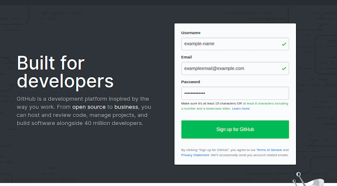
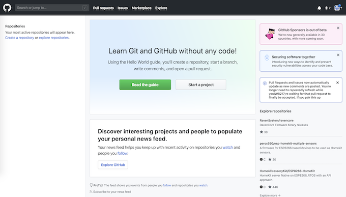
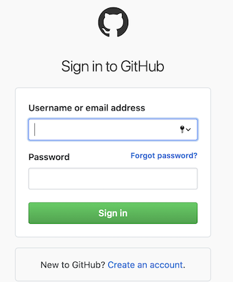
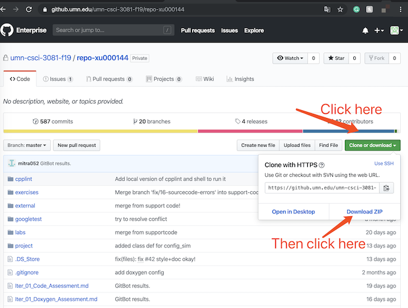
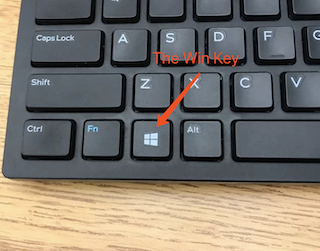
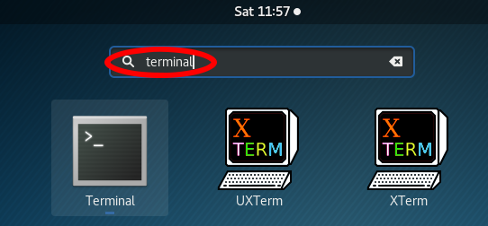
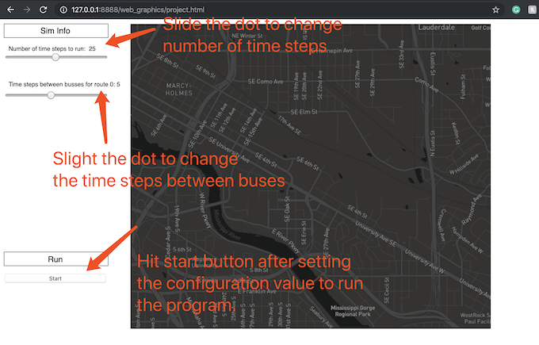
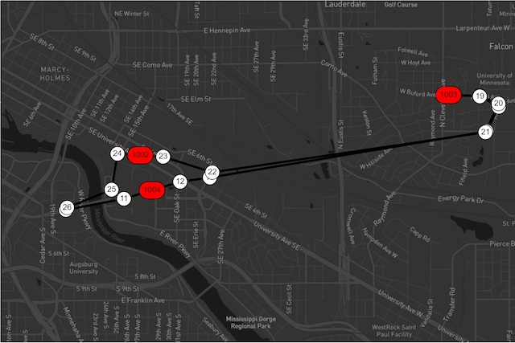

 # Documentation of Campus Transit Simulator System

 <hr>

 ## Introduction of TransitSim
 <hr>

 ### Overview

 This is a transit simulator system in which simulations can be controlled
 via external configuration and be visualized within a graphics window. This
 software system uses the four core classes, passengers, stops, routes, and
 buses to simulate real-life scenarios such as passengers waiting at the
 stops, passengers getting on and off the bus, buses running on the routes, and
 buses picking up passengers at the stops.

 This simulator system can truely effectively reflect the real situation of
 transit operations, and help Transit staff to more effectively manage and
 supervise transit operations.

 This system includes three main programs, namely Transit Simulator,
 Visualization Simulator, and Configuration Simulator and four core classes,
 namely Passenger, Bus, Stop, and Route. This document will give
 them a detailed introduction, design analysis, and operation guide

 <hr>
 ## Quick Start Guide For Experienced Users or Developers
 <hr>
 ### Step 1: Prerequisites:
   1. Make sure you have a GitHub account.
   2. You need to run this program on one of the following CSELabs machines:
    1. Keller 1-250: csel-kh1250-[01|02|...|37].cselabs.umn.edu
    2. Keller 4-240: csel-kh4240-[01|02|...|10].cselabs.umn.edu
    3. Keller 4-250: csel-kh4250-[01|02|...|49].cselabs.umn.edu


  ### Step 2: Getting Project Code:
    Make a pull request from:
```
    https://github.umn.edu/umn-csci-3081-f19/repo-xu000144.git
```

  ### Step 3: Making Executable Files
    1. Change your current directory to the project directory:
    `cd Desktop/CSCI3081/repo-[x500]/project/`
    2. Simply type the command "make" (without quote signs) to make all
    executable files at a time.

  ### Step 4: Runing Executable Files
   ####1. For Transit Simulator:
   Run the command below to execute the Transit Simulator executable file:
```
   ./build/bin/transit_sim
```
   ####2. For Visulization Simulator:
      1. Navigate to base project directory(project/)
      2. Make and start server:
```
        $ cd src
        $ make <sim target>
        $ cd ..
        $./build/bin/<sim executable> <port_number>
```
        - <port_number> can be anything. Try and pick numbers above 8000 and not
          multiples of 10.
        - You must run by doing `./build/bin/<sim executable> <port_number>`.
        - You _cannot_ cd to bin/ and run `./<sim executable> <port_number>`
      3. Navigate to the following address on your browser (Firefox/Chrome):
```
      http://127.0.0.1:<port_number>/web_graphics/project.html
```

  ####3. For Runing Configuration Simulator in defualt:
      run the command below to execute the Transit Simulator executable file:
       >
       > `./build/bin/transit_sim`
       >
       - Without speciying additional arguments in Terminal, Configuration Simulator
        runs in a defualt configuration:
          1. config_sim uses the defualt config.txt file in a folder
          called config.
          2. The number of timesteps is set to 50 rounds.
          3. A bus is generated every 5 rounds.

   ####4. For Runing Configuration Simulator with a user defined configuration:
      1. Usage: ./build/bin/configuration_sim <config_filename> <numTimeSteps>
      <busStartTimings>.


 <hr>
 ## Four Core Classes from Software Development Perspective
 <hr>

 ### General Understanding of Transit Operation

 This software system uses the four core classes, passengers, stops, routes, and
 buses to simulate simulate real-life scenarios such as passengers waiting at
 the stops, passengers getting on and off the bus, buses running on the routes,
 and buses picking up passengers at the stops.
 \ref Passenger will show up at \ref Stop in some given possibility in each time
 unit. When more than one \ref Bus is generated for a \ref Route, the route
 takes care of stops. After a bus has passed a stop but has not yet finished
 its route, it is possible for passengers to "show up" to stops the bus has
 already passed. However, when another bus is created for the same route, it
 should come and pick up these passengers. This means that each bus may have its
 own understanding of its own route, but the stops have relationships with
 multiple buses in the simulation. This is something we will discuss and work
 through in class.
 <hr>


 ### Passenger

 This class describes the behavior of campus transit passengers.
 They are either waiting at a stop or on a bus. The \ref Update function
 counts the time the passenger is at a stop and on a bus if the
 passenger \ref GetOnBus.

 A new passenger should wait at an assigned stop initially. When a bus comes by,
 to make a passenger get on the bus, the member function \ref GetOnBus changes
 the status of the passenger from waiting at a stop to getting on a bus.

 The update function records the time when passengers are waiting at a stop,
 riding on a bus as it moved, or getting on/off the bus.
 <hr>


 ### Stop

 This class describes the behavior of the stops in campus transit.
 It represents each place a bus stops to pick up and drop off passengers.

 Stops are basic units of routes, each of them is made up of a stop id and
 real-world coordinates. The default coordinates have been set to the location
 of the Coffman Union.

 Each stop has a set of passengers who are waiting for the bus. The list
 structure is adapted to manage the passengers. After getting on the bus, the
 passenger should be poped of from the passenger list and added the bus's
 passenger list.
 <hr>


 ### Route

 This class describes the behavior of the routes of the campus transit.
 Routes are a series of stops. Each of them has an instance hold references
 to each of its stops as well as the distances between each stop.

 The route is more like a stop manager and an information transmitter. It is
 responsible for updating the stops on the route, it also needs to tell buses
 the information about the next stop by tracking the destination_stop_index_.
 <hr>


 ### Bus

 This class describes the behavior of the buses operating on the transit.
 Buses have a speed (a distance to move per time unit) and a max capacity
 for passengers. Every Bus keeps track of the passengers on that Bus.

 Each bus has two routes, outbound and inbound and they may need to be recycled
 after finishing these two routes. Buses have a passenger list to maintain and
 update the passenger on boards.

 Note that buses shell skip a stop when no passenger is waiting at the stop and
 no passenger is getting off. But it shouldn't skip more than one stop at a
 time.

 <hr>
 ## Operations and Functionalities of Simulators From Software Development View
 <hr>
 ### Transit Simulator
 Transit Simulator is the most straightforward simulator in this simulation
 system. The simulation is limited to a single scenario involving campus
 transit via buses here at the University of Minnesota.

 <hr>
 ### Visualization Simulator
 Visualization Simulator is similar to Transit Simulator but it allows the users
 to change the values of the number of time steps and the number of time steps
 between buses in the web-based graphic interface. However, it still uses a
 fixed transit configuration.

 The domain elements (Bue, Passenger, Route, and Stops) are extended to produce
 the data needed for visualization.

 <hr>
 ### Configuration Simulator

 #### Overview of Configuration Simulator

 Configuration Simulator provides the most flexibility for users to customize
 the ability of this simulation system. It not only allows the users
 to change the values of the number of timesteps and the number of timesteps
 through command line arguments, but it also allows users to define a customized
 configuration by creating configuration text files.

 #### Guide of Creating a Customized Configuration Files

 1. All configuration files should be placed in project/config folder.

 2. All configuration files should be .txt format.

 3. Below is a template for creating a new Configuration File:
   - Replace <route general name> with a new route general name.
   - Replace <route name> with a new route name.
   - Replace <stop name> with a new stop name.
   - Replace <Longtitude> and <Latitude> with the geographical coordinates of
   the new stop.
   - Replace <Probability of Pass Gen> with the probability of a passenger shows
   up at the stop in each timestep.
   - Note that you can define up to 16 stops for a route but you can only
   define two routes for each configuration file.

```
  ROUTE_GENERAL, <route general name>

  Stop Name, Long, Lat, Pass Gen Prob

  ROUTE, <route name>

  STOP, <stop name>, <Longtitude>, <Latitude>,  <Probability of Pass Gen>
  STOP, <stop name>, <Longtitude>, <Latitude>,  <Probability of Pass Gen>

  ROUTE, <route name>

  STOP, <stop name>, <Longtitude>, <Latitude>,  <Probability of Pass Gen>
  STOP, <stop name>, <Longtitude>, <Latitude>,  <Probability of Pass Gen>
```
<hr>
## Testing For Core Classes and Key Functionalities
<hr>
### Unit Tests For Core Classes
<hr>

#### General Understanding of Unit Tests
  A formal testing framework, such as Google Test, provides a powerful and
  convenient mechanism for testing this system. It does this without requiring
  developers to modify the source code or pollute it with test statements.

#### Run Unit Tests For Four Classes:
  1. Navigate to project/test directory.
  2. Run "make" to create a unit test executable file called unittest.
  4. Run the command below to run the whole unittest:
  >
  > `./../build/bin/unittest`
  >


<hr>
### Regression Test For Configuration Simulator
<hr>

#### General Understanding of Regression Test
  The purpose of the regression test is to test the config_sim and vis_sim. The
  goal of regression tests is to verify that features in this simulation system
  that were already working continue to work, even as other developers add the
  new functionality.

#### Disable Random Passenger Generation
  The purpose of disabling random passenger generation is to have a constant
  result for testing output.

  To do that:
    1. Navigate to passenger_factory.cc in the src folder.
    2. Uncomment the code at line 15.

#### Run Regression Unit Test For Configure Simulator: rtest_config_sim.

To do that:
  1. Navigate to project/test directory then change the file
    regtest_config_UT_cc.txt to tests/regtest_config_UT.cc.
  2. Run "make" to create a unit test executable file.
  3. Run the command below to run the whole unittest:
  >
  > `./../build/bin/unittest`
  >
  4. Change directory to project and run "make rtest_config_sim" to compile the
  Regression Test version of Configure Simulator
  5. Run the command below to run the Regression Test version of Configure
  Simulator normally:`./build/bin/rtest_config_sim`
  6. This version of the Configure Simulator also follows the convention of
    command-line arguments.

  <hr>
  ## Project Refactoring and Further Improvement
  <hr>
  ### Visiting Refactoring Branch
  <hr>
  1. Run the command below to check out the refactoring branch to access the
  refactoring version:
  >
  > `git checkout refactor/iter3`
  >
  ### Modification Details
    1. Last Stop Probability
      - The current version of the probability list for stops includes the value
        for the final stop on a route. With nowhere to go, that probability needs
          to be 0. But, with configuration files, this can't be guaranteed
          without some changes to our code. Refactor the code so that there is no
          probability (even if provided by configuration) for the final stop in a
          route, and that the simulator does not use or try to access such a
          probability for the final stop in a route.
      - In project/src/passenger_generator.cc, the line below was added at line
        14 to make sure the last element of the generation_probabilities_ list
        is 0.
  ```
        generation_probabilities_.list::pop_back();
        generation_probabilities_.list::push_back(0);
  ```
   2. Function Extraction Probability
     - This refactoring extracts two methods from a long redundant code. So it not
       only makes the code more understandable and readable but also allows me to
       reuse existing code and avoids large-scale copy and paste the code. Besides
       that, if other programmers or myself need to make changes or debug the docking
       process, this will not only reduce the workload of modifications but also
       avoid potential errors caused by copy and paste.
      - A new method called void Bus::SkipStop(float distance)  and a new method
      called double Bus::DockingProcess(Route * cur_route, float distance) is
      added at bus.cc.
      - The newly added methods were declared in bus.h.
      - In Update(), remove the code that handles the situations when the bus
        arrives at a stop under the if statement at line 74(outbound) and
        97(inbound) then substitute in the new method DockingProcess.
      - In DockingProcess(), remove the code that handles the situations of
        skipping stop under the if statement at line 79 then substitutes in the
        new method SkipStop.

 <hr>
 ## User Guide For Non-technical Users
 <hr>
 ### Step 1: Prerequisites

   #### Basic Requirement
      1. You need to have access to CSE Labs.
      2. You need to have a working CSE account.
      3. If you don't have a working CSE account:
          1. Visit https://z.umn.edu/csel-register to get your CSELabs account.
          2. Please email operator@cselabs.umn.edu with any concerns.


   #### System Requirement
   1. You need to run this program on one of the following CSELabs machines, if
  you are having trouble to access to CSELabs, refer to the section above:
    1. Keller 1-250: csel-kh1250-[01|02|...|37].cselabs.umn.edu
    2. Keller 4-240: csel-kh4240-[01|02|...|10].cselabs.umn.edu
    3. Keller 4-250: csel-kh4250-[01|02|...|49].cselabs.umn.edu

   > Note that do not use the machines in Walter library as they are using
   > different system images.
   > The program will not compile on those machines.


  <hr>
 ### Step 2: Getting Project Code

   #### Setting Up GitHub Account
    1. Visit the Github Official website: https://github.com.

    2. In the Sign-up box at the left of the web page:
      1. put in your username in the Username textbox:
        - Username may only contain alphanumeric characters or single hyphens,
        and cannot begin or end with a hyphen.
      2. put in your Email address  in the Email textbox:
      3. put in your password in the Password textbox: Make sure it's at least
      15 characters OR at least 8 characters including a number and a lowercase
      letter. 


    3. After filling in all the textboxes, click the green button to submit your
    information.

    4. If you are redirected to the GitHub main page that is similar below
    after submitting, congratulations, you now have a GitHub account.
    > Note that the example page below might be slightly different from what
    > you have.


    5. If you are not redirected to the GitHub main page that is similar above
    after submitting, don't worry, simply click on the sign-in button right
    above the sign-up box. Put in your username and password you just created
    after being redirected to the sign-in page like below:




   6. Getting the Project Repository to customize input value
    - If you don't see the simulation result after hitting enter, check your
      input arguments based on the error message and instruction that the
      program returns to correct your input.

  <hr>
  ### Step 5: Finalizing
  1. Now type the command below then hit enter on your keyboard to confirm
  you are within the project directory as introduced above.
  >
  > `pwd`
  >
  2. Simply type the command "make clean" (without quote signs) to delete all
  executable files at a time.

    Now it is time to download the project code to your local machine:
    1. Copy the link below to the URL bar at the top of your browser then hit
    "enter" on your keyboard:
    >
    > https://github.umn.edu/umn-csci-3081-f19/repo-xu000144.git
    >
    2. You will then see the repository page below. Click on the green
    "clone or download" button, then click Download ZIP button at bottom of
    the pop-up window.


    3. Save the ZIP file to Desktop.

    4. Double click on the ZIP file to extract the files to Desktop.

 <hr>
    ### Step 3: Launching Terminal And Making Executable Files

  #### Launching Terminal and Changing Directory
    1. Hit the Win button on your keyboard or click the Apps icon at the
    bottom left of the screen to get to the launchpad.

    2. Type the keyword "Terminal" (without quote signs) into the search box at
    the top of the launchpad screen, then hit enter on your keyboard.

    3. Once the Terminal pops up, type in the command below then hit enter
    to change your current directory to the project directory:
    >
    > `cd Desktop/CSCI3081/repo-[x500]/project/`
    >

  #### Making Executable Files
    1. Now type the command below then hit enter on your keyboard to confirm
    you are within the project directory as introduced above.
    >
    > `pwd`
    >
    2. Simply type the command "make" (without quote signs) to make all
    executable files at a time. (If you see a big chunk of text pop up on
    your Terminal window, you are on the right track.)

    3. Type the command below then hit enter on your keyboard to make sure the
    executable files are generated:
    >
    > `ls build/bin/`
    >
    If you see the Terminal returns the four executable files as shown below,
    you are on the right track.
    >
    > `config_sim*  rtest_config_sim*    transit_sim*  vis_sim*`
    >

    <hr>
    ### Step 4: Running Executable Files

  #### Running Transit Simulator: transit_sim
  1. To make sure you are still in the project directory, type the command
  below then hit enter on your keyboard:
  >
  > `pwd`
  >
  If the return directory is not
  `/home/[x500]/Desktop/CSCI3081/repo-[x500]/project/`, redo Step 3.

  2. Type the command below then hit enter on your keyboard to execute the
  Transit Simulato executable file:
  >
  > `./build/bin/transit_sim`
  >

  3. The Transit Simulator uses the fixed default configuration as below:
    1. The number of timesteps the simulator runs is 50.
    2. The passengers are randomly generated based on the default configuration.
    3. It is using default routes and stops.
    >
    > For default configuration, see open the config.txt in config folder
    > for further references.
    >

  #### Running Visualization Simulator: vis_sim
  1. To make sure you are still in the project directory, type the command
  below then hit enter on your keyboard:
  >
  > `pwd`
  >
  If the return directory is not
  `/home/[x500]/Desktop/CSCI3081/repo-[x500]/project/`, redo Step 3.

  2. Type the command below then hit enter on your keyboard to execute the
  Visulization Simulator executable file.
  The <port_number> is a 4-digits number above 8000 and not multiples of 10.
  eg. 8888, 8899, or 9999.
  >
  > `./build/bin/vis_sim <port_number>`
  >

    - Make sure you see the following after hitting enter:
    ```
     Usage: ./build/bin/ExampleServer 8081
     Using the default config file: config.txt
     starting server...
    ```
  3. Open your favorite browser, then navigate to the URL below, remember to
  substitute the <port_number> to the 4-digits number you picked above.
  >
  > http://127.0.0.1:<port_number>/web_graphics/project.html
  >

  4. There are two sliders at top of the left sidebar, where you can change the
  number of time steps to run and time steps between busses for the routes by
  sliding the little dots. Hit the start button after setting up the desired
  configuration.
  

  5. Hover your mouse over the buses and stop for more information about the
  current state of the simulation.

  6. The Transit Simulator uses the default configuration as below:
    1. The passengers are randomly generated based on the default configuration.
    2. It is using default routes and stops.
    >
    > For default configuration, see open the config.txt in config folder
    > for further references.
    >
    


  #### Running Configuration Simulator: config_sim in default:
  1. To make sure you are still in the project directory, type the command
  below then hit enter on your keyboard:
  >
  > `pwd`
  >
  If the return directory is not
  `/home/[x500]/Desktop/CSCI3081/repo-[x500]/project/`, redo Step 3.

  2. Type the command below then hit enter on your keyboard to execute the
  Configuration Simulator executable file in the default configuration.
  >
  > `./build/bin/config_sim`
  >

  3. Without specifying additional arguments in Terminal, Configuration
  Simulator runs in a default configuration:
    1. config_sim uses the default config.txt file in a folder
    called config.
    2. The number of timesteps is set to 50 rounds.
    3. A bus is generated every 5 rounds.

  #### Running Configuration Simulator: config_sim with a user-defined config:

  1. To define a configuration file, follow the template mentioned in the
  previous section.

  2. To use a different configuration file, type the name of the new
  configuration file after the executable name, for example, if the new
  configuration file is named as new_config:
  >
  > `./build/bin/config_sim new_config.txt
  >

  3. To change the number of timesteps the config_sim should run, type the
  command below in terminal, then replace the <config_filename> with a
  configuration file name and replace the <numTimeSteps> with an integer of
  desired number of timesteps:
  >
  > `./build/bin/config_sim <config_filename> <numTimeSteps>
  >
    -  Note that you need to specify a configuration file name to customize the
    number of timesteps if you want to use the default value, substitute
    <config_filename> with config.txt.

  4. To change the number of timesteps between buses, type the
    command below in terminal, then replace the <config_filename> with a
    configuration file name, replace the <numTimeSteps> with a desired number
    of timesteps, and replace the <busStartTimings> with an integer of the
    desired number of timesteps,
    >
    > `./build/bin/config_sim <config_filename> <numTimeSteps> <busStartTimings>
    >
      -  Note that you need to specify a configuration file name and the number
      of timesteps the config_sim should run to customize the number of
      timesteps between buses.

  5. Hit enter after typing in your customize input value.

  6. If you don't see the simulation result after hitting enter, check your
  input arguments based on the error message and instruction that the program
  returns to correct your input.

  <hr>
  ### Step 5: Finalizing
  1. Now type the command below then hit enter on your keyboard to confirm
  you are within the project directory as introduced above.
  >
  > `pwd`
  >
  2. Simply type the command below to delete all executable files at a time.
  >
  > `make clean`
  >


 *
 */
